# Stormont Vail Health — Load Analysis Executive Summary

**ASA DataFest 2026 · Team Immortal**

*Bagaimana hambatan sosial (transportasi & keuangan) mendorong pasien ke Unit Gawat Darurat, dan apa nilai finansial dari memperbaikinya.*

> **Catatan Dataset:** Data yang digunakan dalam analisis ini bersifat **private access** dan **tidak dipublikasikan di Kaggle** maupun platform publik lainnya. Dataset hanya tersedia bagi peserta yang berwenang dalam konteks ASA DataFest 2026 dan tidak dapat dibagikan ulang. Project ini murni hanya menampilkan hasil analisis

---

## 1. Problem Definition — Apa yang Ingin Dijawab

Stormont Vail Health (SVH) menangani ratusan ribu pasien setiap tahunnya — 238.471 pasien unik tercatat sepanjang 2025. Mayoritas interaksi ini berjalan lancar lewat jalur rawat jalan (outpatient). Tapi ada satu titik yang terus jadi beban: Unit Gawat Darurat (Emergency Department / ED). Mahal untuk dioperasikan, dan yang lebih penting, bebannya terus berulang dari tahun ke tahun.

Asumsi yang biasa dipegang tim operasional rumah sakit sederhana: pasien datang ke ED karena kondisinya memburuk mendadak. Analisis ini justru ingin menguji ulang asumsi tersebut, dengan satu hipotesis yang jadi titik berangkat:

> Pasien rentan sering datang ke ED bukan semata karena kondisi darurat — melainkan karena ED menjadi **jalan terakhir** setelah akses ke perawatan rutin mereka terhambat, entah karena tidak punya transportasi atau karena kondisi finansial yang sulit.

Dari hipotesis itu, analisis ini disusun untuk menjawab empat pertanyaan besar:

1. **Disparitas utama** — Apakah pasien dengan hambatan sosial benar-benar lebih sering ke ED dibanding yang tidak?
2. **Risiko majemuk** — Kalau seseorang menghadapi hambatan transportasi *dan* keuangan sekaligus, apakah risikonya berlipat ganda?
3. **Profil klinis** — Kunjungan ED mereka itu benar keadaan darurat mendadak, atau sebenarnya penyakit kronis yang bisa ditangani di klinik biasa?
4. **Alur sistem & dampak ekonomi** — Di mana letak kemacetan pada jaringan rujukan, dan seberapa besar potensi penghematan jika ini diperbaiki?

Untuk menjawabnya, pasien dikelompokkan ke dalam empat kategori yang dipakai konsisten di seluruh analisis:

| Kelompok | Definisi |
|---|---|
| **No Barrier** | Tidak ada hambatan transportasi maupun keuangan |
| **Financial Only** | Hanya hambatan keuangan |
| **Transport Only** | Hanya hambatan transportasi |
| **Both Barriers** | Menghadapi kedua hambatan sekaligus |

---

## 2. Temuan + Visualisasi

### 2.1 Gambaran Sistem: ED Kecil dalam Volume, Besar dalam Beban

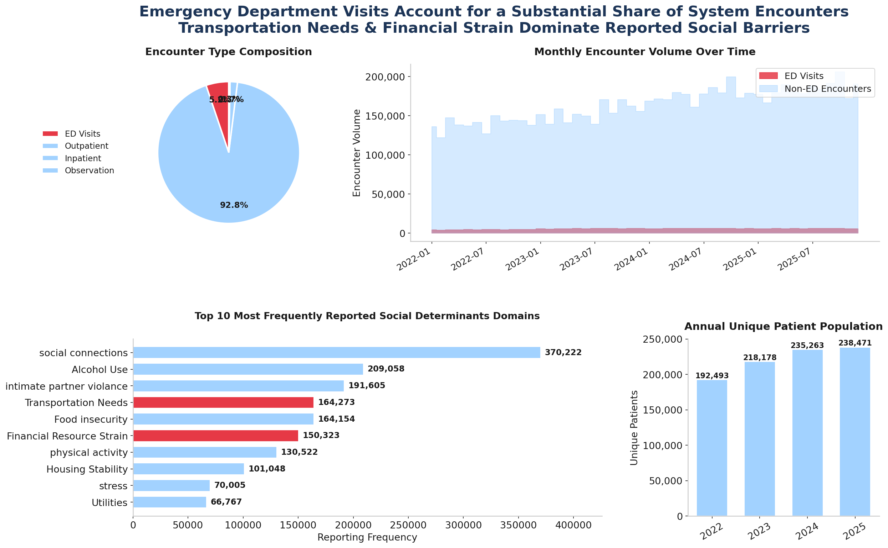

Kalau dilihat dari komposisinya, ED sebenarnya cuma **5,0%** dari total encounter — outpatient jauh mendominasi dengan **92,8%**. Tapi jangan salah, angka kecil ini tetap besar secara absolut dan terus tumbuh stabil dari 2022 sampai 2025. Saat menyaring domain hambatan sosial yang ada, dua nama ini paling menonjol sebagai penghambat akses: **Transportation Needs (164.273)** dan **Financial Resource Strain (150.323)**.

### 2.2 Headline: Hambatan Sosial Mendorong Pemakaian ED Secara Sistematis

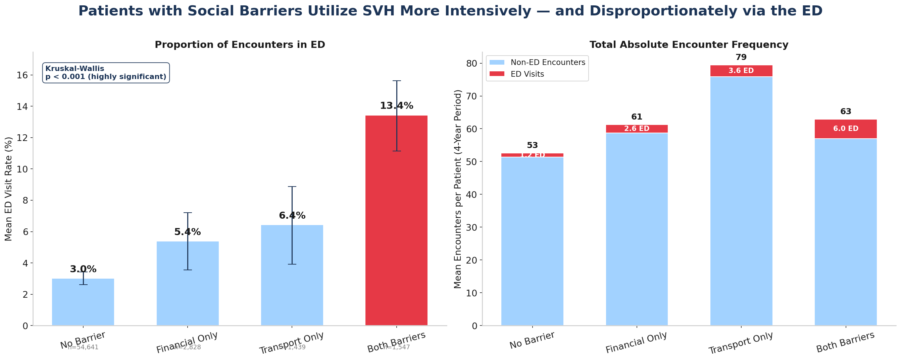

Dari 359.760 pasien yang ada, 61.446 di antaranya disaring khusus untuk melihat hambatan sosial mereka. Dan begitu pola pemakaian ED dipetakan, arahnya jelas: makin berat beban hambatan yang ditanggung, makin sering pula mereka lari ke ED.

| Kelompok | Rata-rata ED Rate | Pasien dengan ≥1 kunjungan ED | Rata-rata total kunjungan (4 thn) |
|---|---|---|---|
| No Barrier | 3,01% | 41,6% (CI 41,2–42,0) | 52,60 |
| Financial Only | 5,39% | 57,4% (CI 55,6–59,2) | 61,31 |
| Transport Only | 6,43% | 63,9% (CI 61,4–66,4) | 79,46 |
| **Both Barriers** | **13,44%** | **71,2% (CI 68,9–73,4)** | 62,94 |

Uji Kruskal-Wallis mengonfirmasi gradien ini memang sangat signifikan (H = 1.719,35; p < 0,001). Yang paling mencolok, pasien Both Barriers rata-rata mengalami **5,98 kunjungan ED** — hampir 5x lipat dari baseline 1,25.

### 2.3 Beban per Perjalanan Penyakit (Disease Journey)

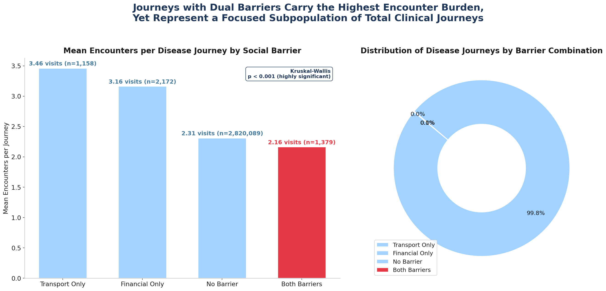

Ketika ditelusuri lebih dalam ke level "disease journey" (perjalanan satu pasien menangani satu diagnosis), bebannya tetap berbeda signifikan antar kelompok (H = 154,72; p < 0,001). Artinya hambatan sosial bukan cuma menambah frekuensi ke ED, tapi juga menambah intensitas kontak medis secara keseluruhan.

### 2.4 Risiko Majemuk: Efek Sinergis Dua Hambatan

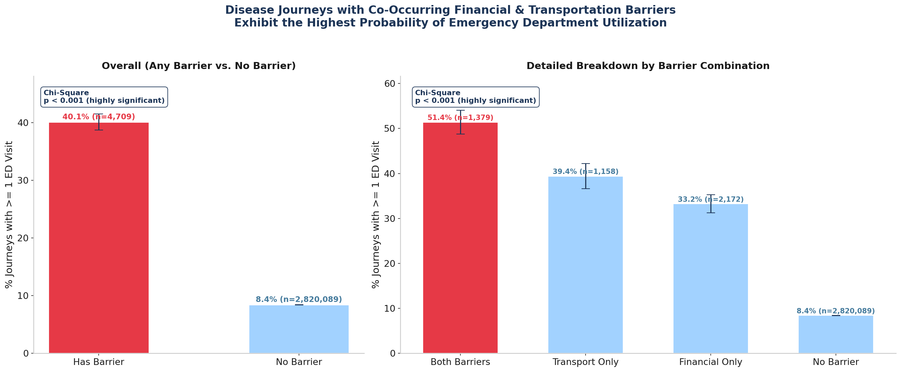

Di level disease journey ini pula perbedaannya jadi paling terasa. Journey yang punya hambatan sosial berujung ke ED sebanyak **40,1%**, sementara yang tanpa hambatan hanya **8,4%** (χ² = 6.074,02; p < 0,001). Kalau dipecah per kombinasi, urutannya begini: **Both Barriers 51,4%**, lalu Transport Only 39,4%, Financial Only 33,2%, dan No Barrier di angka 8,4%.

Pola ini menunjukkan sesuatu yang penting: dua hambatan yang datang bersamaan tidak sekadar menjumlah risikonya, tapi justru **melipatgandakannya**.

### 2.5 Spektrum Klinis: Penyakit Kronis Mendominasi

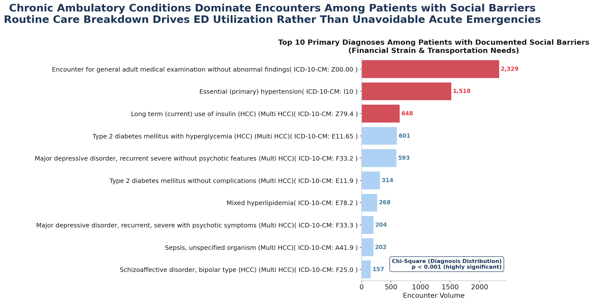

Lalu, apa sebenarnya yang membawa mereka ke ED? Ternyata bukan trauma akut mendadak seperti yang sering diasumsikan. Diagnosis teratas pada kelompok berhambatan justru didominasi **kondisi kronis yang seharusnya bisa dikelola di rawat jalan** — hipertensi, diabetes, dan gangguan tulang belakang (χ² = 80.822,07; p < 0,001).

### 2.6 Distribusi Spasial: Hotspot Geografis

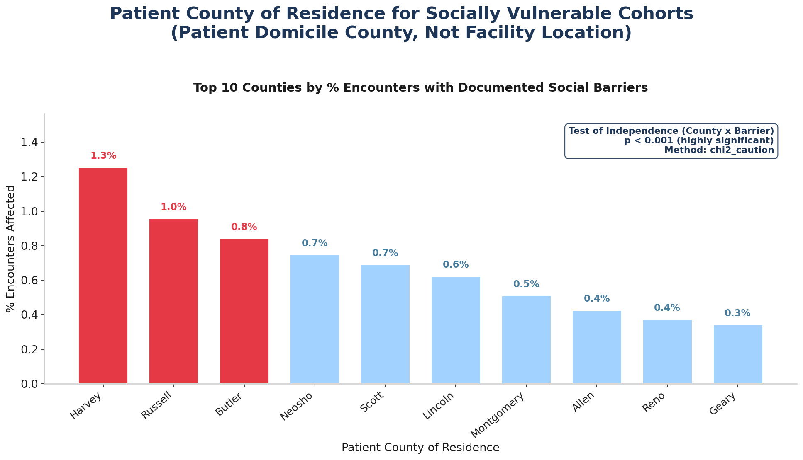

Hambatan ini juga tidak menyebar rata secara geografis (χ² = 740,59; p < 0,001). Beberapa county menunjukkan konsentrasi yang jauh lebih tinggi dibanding wilayah pusat, terutama **Harvey (1,3%), Russell (1,0%), dan Butler (0,8%)**.

### 2.7 Mortalitas & Confounding Demografi

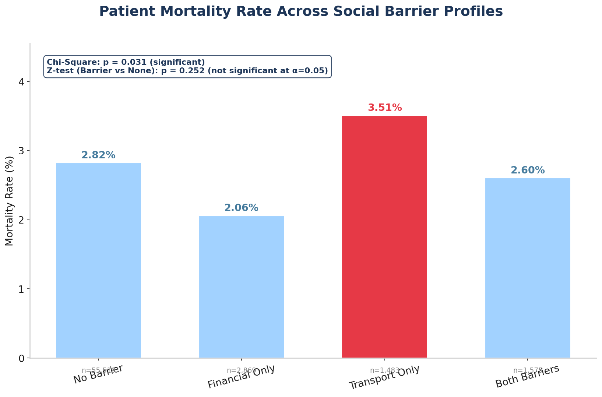

Dari sisi mortalitas, gambarannya agak berbeda. **Transport Only** justru punya mortalitas kasar paling tinggi (3,51%), sementara **Financial Only** paling rendah (2,06%) — perbedaan ini signifikan (χ² = 8,88; p = 0,031). Tapi begitu dibandingkan secara gabungan (ada hambatan 2,56% vs tanpa hambatan 2,82%), perbedaannya **tidak lagi signifikan** (z = −1,14; p = 0,252).

Kenapa bisa begitu? Jawabannya ada di usia. Pasien dengan hambatan finansial cenderung lebih muda, sementara pasien dengan hambatan transportasi cenderung lansia yang secara alami memang punya mortalitas dasar lebih tinggi. Jadi ini lebih ke soal demografi, bukan soal hambatan sosialnya sendiri.

### 2.8 Model Regresi Logistik Multivariabel: Efek Independen Hambatan Sosial

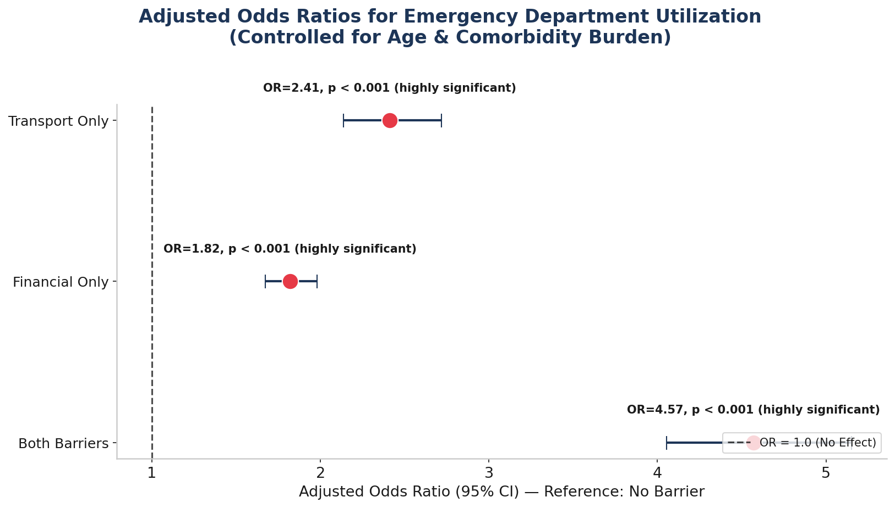

Sampai di sini, wajar kalau muncul pertanyaan: jangan-jangan semua pola di atas cuma karena pasien berhambatan memang lebih tua atau lebih sakit? Untuk menjawabnya, dilakukan regresi logistik yang mengontrol usia, jenis kelamin, dan beban komorbiditas sekaligus. Hasilnya, hambatan sosial tetap berpengaruh kuat dan signifikan (Reference = No Barrier):

| Prediktor | Adjusted Odds Ratio | 95% CI | Makna |
|---|---|---|---|
| **Both Barriers** | **4,57** | 3,97–5,26 | Peluang ED >4,5x lipat |
| Transport Only | 2,41 | 2,04–2,85 | Peluang ED >2x lipat |
| Financial Only | 1,82 | 1,59–2,08 | Peluang ED +82% |
| Comorbidity (per diagnosis) | 1,07 | — | Tiap tambahan penyakit menaikkan peluang |

Semua hasil ini signifikan secara statistik (p < 0,001). Kesimpulannya jadi tegas: migrasi ke ED **bukan sekadar karena pasien "lebih sakit"**. Pada usia dan kompleksitas klinis yang setara, hambatan sosial tetap memaksa pasien untuk lari ke ED.

### 2.9 Digital Health Divide: Penolak MyChart adalah "Power Users"

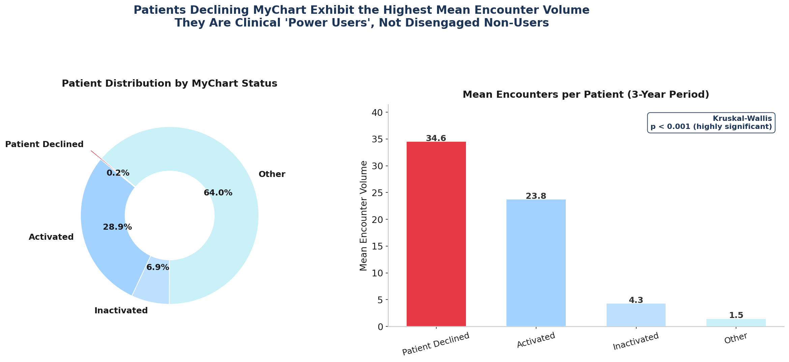

Ada satu temuan menarik di luar topik utama tapi cukup relevan untuk strategi intervensi. Pasien yang **menolak** memakai portal MyChart justru punya volume kunjungan tertinggi di seluruh sistem (H = 440.124,80; p < 0,001). Ini kebalikan dari asumsi umum yang menganggap non-pengguna portal sebagai pasien sehat yang jarang datang.

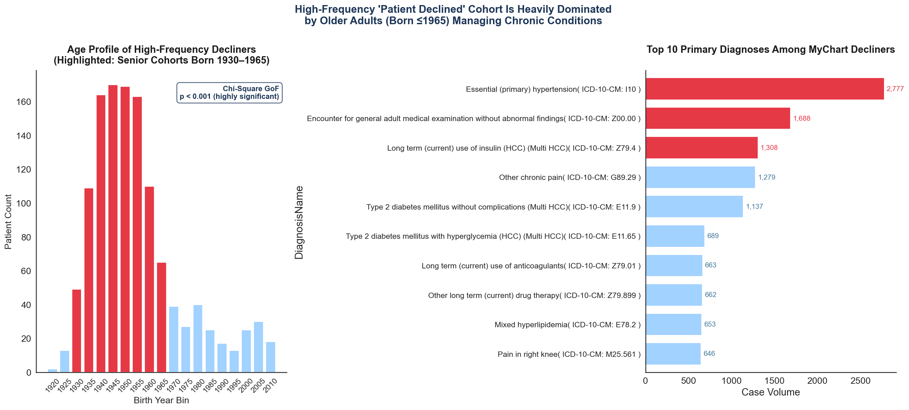

Ditelusuri lebih jauh, penolak frekuensi tinggi ini didominasi **lansia (lahir ≤ 1965)** dengan riwayat penyakit kronis (χ² = 1.577,17; p < 0,001) — justru kelompok yang paling butuh koordinasi perawatan berkelanjutan.

### 2.10 Kapasitas Provider & Bottleneck Jadwal

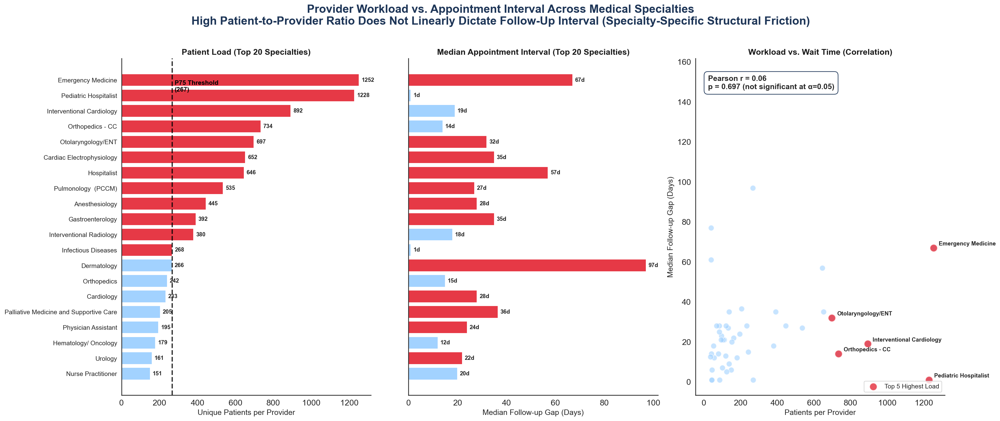

Bergeser ke sisi operasional: apakah kemacetan jadwal follow-up disebabkan provider yang kekurangan tenaga? Ternyata tidak sesederhana itu. Beban provider (pasien per dokter) **tidak berkorelasi linear** dengan lamanya interval follow-up (r = 0,058; p = 0,697). Artinya kemacetan jadwal bersifat **spesifik per spesialisasi**, bukan sekadar soal rasio pasien-dokter secara umum.

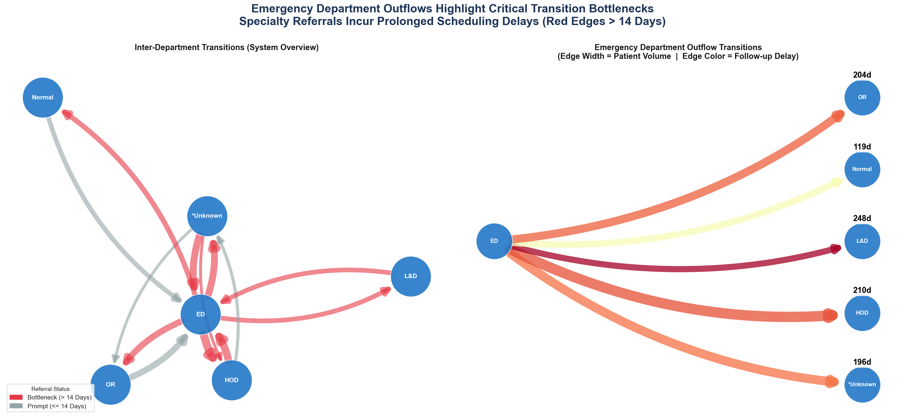

Saat alur rujukan antar-departemen dipetakan sebagai jaringan, titik-titik yang punya interval follow-up lebih dari 14 hari muncul sebagai kemacetan sistem yang paling mencolok.

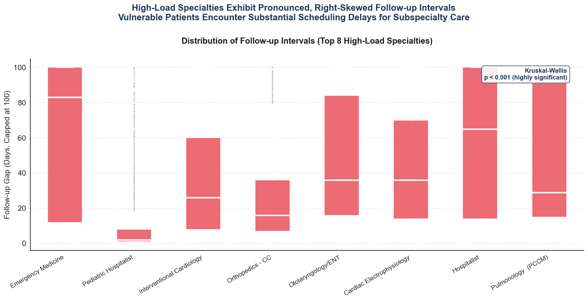

Distribusi interval follow-up-nya sendiri sangat right-skewed dengan outlier ekstrem (H = 7.363,30; p < 0,001) — sebagian pasien menunggu jauh lebih lama dari median, dan ini paling terasa di spesialisasi-spesialisasi yang paling padat.

### 2.11 Pemodelan Finansial: Nilai dari Redireksi ED

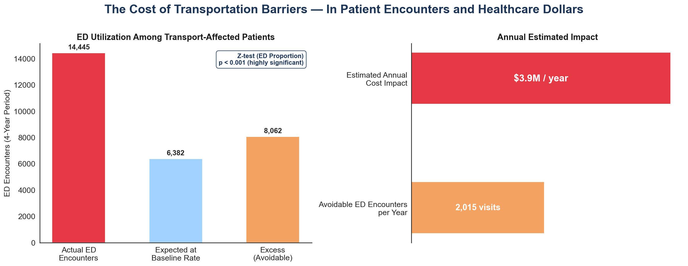

Pertanyaan terakhir: seberapa besar nilai uang di balik semua ini? Dengan benchmark biaya HCUP (ED ~$2.200; outpatient ~$250; selisih ~$1.950 per encounter), gambarannya jadi jelas:

- Populasi terdampak transportasi: **2.986 pasien**
- Kunjungan ED aktual (4 tahun): **14.445**
- Ekspektasi pada baseline rate: **6.382**
- **Kelebihan (berpotensi dihindari): 8.063 kunjungan** (~2.016/tahun)
- ED rate transport-affected 6,82% vs baseline 2,37% (z = 122,36; p < 0,001)

Selisih antara angka aktual dan ekspektasi ini bukan kebetulan — itu ruang penghematan yang nyata kalau hambatan transportasinya diatasi.

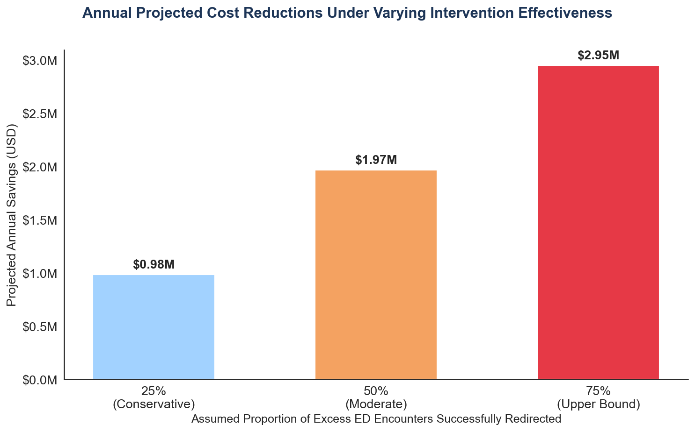

| Skenario | % Diredireksi | Kunjungan ED dihindari/tahun | Estimasi Penghematan Tahunan |
|---|---|---|---|
| Konservatif | 25% | 504 | **$982.630** |
| Moderat | 50% | 1.008 | **$1.965.260** |
| Batas Atas | 75% | 1.512 | **$2.947.890** |

---

## 3. Arti dari Temuan

Kalau seluruh temuan di atas dirangkai jadi satu cerita, alurnya cukup jelas:

1. **Hambatan sosial adalah pendorong akses, bukan sekadar penanda pasien yang sakit.** Regresi multivariabel membuktikan efek ini bertahan bahkan setelah usia dan komorbiditas disamakan. Pasien Both Barriers tetap 4,57x lebih mungkin ke ED dibanding pasien yang secara klinis identik tapi tidak punya hambatan.

2. **Ini pada dasarnya fenomena "pintu yang salah" (wrong door).** Pasien berhambatan tidak menghilang dari sistem kesehatan — justru total kunjungan mereka lebih tinggi. Mereka tetap mencari perawatan, hanya saja terdorong ke saluran yang paling mahal dan paling tidak berkesinambungan, karena klinik rutin tidak terjangkau bagi mereka.

3. **Yang membawa mereka ke ED umumnya penyakit kronis yang sebenarnya bisa dicegah.** Dominasi hipertensi, diabetes, dan gangguan tulang belakang menunjukkan ini soal kegagalan pengelolaan rawat jalan, bukan gelombang keadaan darurat sungguhan.

4. **Ironisnya, kelompok paling rentan justru paling sulit dijangkau lewat kanal digital.** Penolak MyChart adalah lansia dengan penyakit kronis dan frekuensi kunjungan tertinggi — persis populasi yang paling membutuhkan koordinasi perawatan yang baik.

5. **Bottleneck yang terjadi bersifat spesifik, bukan masalah menyeluruh.** Karena keterlambatan follow-up tidak berkorelasi dengan rasio pasien-provider, solusinya bukan menambah tenaga secara merata, tapi menargetkan spesialisasi tertentu yang benar-benar macet.

6. **Dan pada akhirnya, masalah sosial ini punya harga yang bisa dihitung.** Sekadar mengatasi hambatan transportasi saja berpotensi menghindari ~2.016 kunjungan ED per tahun, dengan penghematan hingga ~$2,95 juta per tahun.

---

## 4. Kesimpulan & Saran

### Kesimpulan

Pada akhirnya, beban Unit Gawat Darurat di Stormont Vail Health sebagian besar **bukan** persoalan klinis yang mendadak. Ini lebih tepat disebut gejala dari kegagalan akses yang berakar pada hambatan sosial, terutama transportasi dan tekanan finansial. Pasien yang menghadapi kedua hambatan sekaligus terdorong ke ED dengan peluang 4,57x lipat, bahkan setelah faktor usia dan tingkat keparahan penyakit disamakan. Kunjungan tersebut pun didominasi kondisi kronis yang sebenarnya dapat dikelola, sehingga sifatnya **dapat dicegah**. Dengan begitu, memperbaiki akses bukan cuma soal kesetaraan pelayanan — ini juga peluang nyata untuk menghemat jutaan dolar setiap tahunnya.

### Saran Strategis

**1. Kemitraan Transportasi Medis Non-Darurat (NEMT)**
Integrasikan layanan rideshare (mis. Uber Health / Lyft Healthcare) langsung ke sistem penjadwalan rawat jalan. Mengganti kunjungan ED ~$2.200 dengan klinik ~$250 (ditambah transport ~$15–30) menghasilkan penghematan bersih >$1.900 per encounter. Prioritaskan pasien yang punya janji terjadwal dan positif hambatan transportasi.

**2. Pendampingan MyChart Langsung di Sisi Pasien**
Ganti undangan portal yang pasif dengan bantuan aktivasi tatap muka saat kunjungan berlangsung, khususnya untuk lansia (lahir ≤1965). Navigator klinis bisa membantu pembuatan akun sekaligus mengatur akses proxy bagi pengasuh mereka.

**3. Klinik Keliling di County Hotspot**
Terjunkan mobile clinic secara bergilir ke county dengan konsentrasi hambatan tinggi (Harvey, Butler, Russell) untuk manajemen penyakit kronis yang lebih proaktif, dekat dengan komunitas itu sendiri.

**4. Ekspansi Kapasitas Rawat Jalan yang Ditargetkan**
Sediakan dukungan transportasi cadangan bila slot klinik penuh. Perluas kapasitas tenaga mid-level (NP/PA) dan sederhanakan jalur rujukan pada spesialisasi yang paling macet, misalnya Pulmonologi dan Neurologi.

### Langkah Berikutnya

- **Segera:** Jalankan pilot program NEMT yang terintegrasi dengan EHR, khususnya untuk pasien positif hambatan transportasi yang sudah punya janji terjadwal.
- **Strategis:** Tempatkan navigator digital untuk lansia, serta koordinator perawatan yang bisa mempercepat rujukan spesialis pasca-ED.

---

## Catatan Keterbatasan Metodologis

Perlu digarisbawahi, temuan di atas bersifat **observasional & cross-sectional**. Artinya, ini menunjukkan korelasi, bukan sebab-akibat definitif, sehingga intervensi apa pun sebaiknya tetap diuji lewat rollout bertahap atau acak sebelum diterapkan penuh. Beban komorbiditas sendiri dihitung dari jumlah diagnosis unik, bukan skor terstandar seperti Charlson atau Elixhauser. Estimasi biaya juga memakai benchmark nasional HCUP yang bisa saja berbeda dari biaya internal SVH yang sebenarnya. Terakhir, data skrining SDOH hanya mencakup pasien yang aktif disurvei — ada kemungkinan selection bias di sini — dan usia pasien diperkirakan dari titik tengah rentang tahun lahir 5-tahunan, bukan usia pasti.
